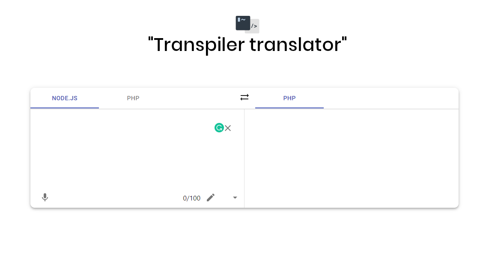

## Transpiler Translator is a pseudo translator tool for code, it's Google Translator based.

     
#### Transpiler Screenshot

## Contribute

You can contribute by sending a pull request :).

In the project directory you can execute theses commands bellow 

### `yarn start`

Runs the app in the development mode. 
Open [http://localhost:3000](http://localhost:3000) to view it in the browser.

The page will reload if you make edits. 
You will also see any lint errors in the console.

### `yarn test`

Launches the test runner in the interactive watch mode. 
See the section about [running tests](https://facebook.github.io/create-react-app/docs/running-tests) for more information.

### `yarn build`

Builds the app for production to the `build` folder. 
It correctly bundles React in production mode and optimizes the build for the best performance.

The build is minified and the filenames include the hashes. 
Your app is ready to be deployed!

See the section about [deployment](https://facebook.github.io/create-react-app/docs/deployment) for more information.

## Credits
Author Twitter - [Jimmy Starling](https://twitter.com/_jimmystarling_)
Create React App - This project was bootstrapped with [Create React App](https://github.com/facebook/create-react-app).